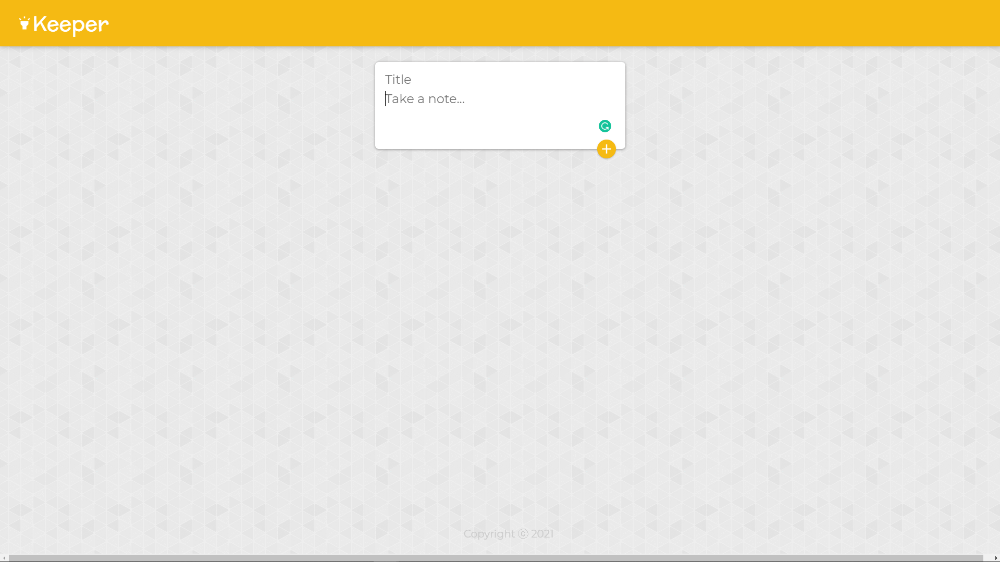
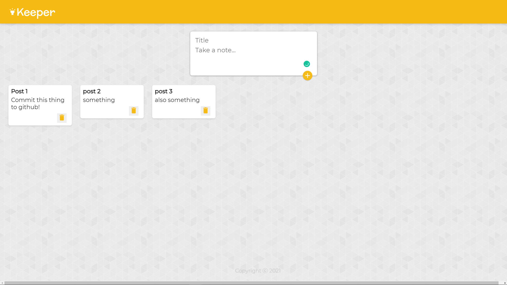

# KeeperApp

Languages: HTML, CSS. Javascript
Frameworks: React, Bootstrap

Created a webapp that allows users to create and delete notes. Front end functionality so far only.

To Add: 
-User base System/Login System
-Database to store notes

<strong>Project Preview</strong>

